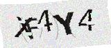

# captcha_alpha —— 验证码智能识别与训练引擎

> **作者**：周亮 Ryo Zhou
>
> **邮箱**: zlgm2007@gmail.com

独立的验证码工具集，包含两条能力：

1. **识别**：预处理增强 + ddddocr 识别（`src/main.py`）
2. **训练**：用 dddd_trainer 训练特定验证码的专用模型，提升识别率（`captcha_trainer/`）

本目录**不依赖 spiderNestMVP 工程其他模块**，可独立使用。

**项目目标**：解决通用 OCR 模型识别**困难验证码**的问题。对清晰简单的验证码，通用 ddddocr 已能稳定识别；但面对细笔画、字符粘连、噪声干扰的验证码，通用模型会漏字/误字。项目通过「预处理增强 + 多策略择优 + 逐字符兜底」提升裸识别率，并在此基础上训练专用模型进一步逼近正确答案。

---

## 目录结构

```
captcha_alpha/                            # 验证码识别与训练工具（仓库根目录）
├── README.md                           # 本文档
├── .gitignore                          # git 提交规则（忽略 IDE/工具配置、缓存、预处理产物）
├── requirements.txt                    # 核心依赖（识别 + MCP）
├── src/                                # 主工程代码
│   ├── main.py                         # CLI 入口：参数解析 + 格式化输出（调用 api.py）
│   ├── api.py                          # API 层：CaptchaRecognizer 类，供 SDK 调用
│   ├── preImg.py                       # 图片预处理模块（去噪/gamma/背景提白/放大/二值化/噪点修复）
│   ├── ddddocrImg.py                   # ddddocr 识别模块（整图 / 逐字符，支持自定义模型）
│   └── label_tool.py                   # 标注工具（OCR 预填 + 人工校正）
├── mcp/                                # MCP 相关（AI Agent 接入）
│   ├── mcp_server.py                   # MCP Server：暴露识别能力给 AI Agent（WorkBuddy/Claude）
│   ├── setup_mcp.py                    # 一键安装：注册 MCP + 导入技能包
│   └── captcha-recognition/            # 技能包（SKILL.md + API 参考）
├── tests/
│   └── test_captcha.py                 # pytest 测试套件（60 项，覆盖识别 + API + 择优逻辑 + 已知困难样例）
├── experiments/                        # 分析实验脚本（bc_0001 粘连诊断 / 骨架化 / 多 OCR 引擎对比）
│   ├── analyze_fusion.py              # 垂直投影 / 低谷分析 / 预处理对比
│   ├── experiment_bc0001.py           # 形态学腐蚀断连 / 颈部切分 / 多尺度识别
│   └── experiment_skeleton.py         # Zhang-Suen 骨架化 / 分叉点 / 连通域分析
├── images/
│   ├── test.png                        # 困难测试样例（正确答案 xf4y4，已修复）
│   ├── test2.jpg                       # 简单测试样例（正确答案 kdqu，可稳定识别）
│   ├── test3.png                       # 测试样例（输出 phhxx）
│   ├── bc_0001.png                     # 抖音验证码（正确答案 ctyx，y/x 粘连，需训练专用模型）
│   ├── bc_0002.png                     # 抖音验证码（正确答案 9tns3，自适应阈值变体已解决 ✅）
│   └── bc_0003.png                     # 抖音验证码样本（验证预处理不误伤干净图）
├── captcha_data/
│   ├── raw/                            # 待标注图片目录
│   └── labeled/                        # 标注输出目录（label_hash.png）
├── captcha_data_labeler/               # 独立标注工具（Web + stdlib 零依赖，server.py + static/）
├── captcha_trainer/                    # dddd_trainer 训练框架（已适配 Python 3.12 + 新版 torch）
│   ├── app.py                          # 训练 CLI（create / cache / train）
│   ├── configs/                        # 全局配置基类
│   ├── nets/backbone/                  # 可选骨干网络（ddddocr / efficientnet / mobilenet）
│   ├── utils/                          # 缓存 / 加载 / 训练工具
│   ├── projects/douyin_captcha/        # 训练项目：常规验证码（小模型 CPU/MPS 快速训练）
│   │   ├── config.yaml                 # 项目配置（GPU/灰度/高度/宽度/CRNN）
│   │   ├── cache/                      # 标注缓存（训练时自动生成）
│   │   ├── checkpoints/                # 训练 checkpoint（训练时自动生成）
│   │   └── models/                     # 导出模型 onnx + charsets.json（训练时自动生成）
│   ├── projects/apple_captcha/         # 训练项目：难样本（迁移学习 ddddocr 权重微调）
│   │   ├── config.yaml                 # 项目配置（backbone/分辨率/增强等难样本参数）
│   │   ├── cache/                      # 标注缓存（cache.train.tmp / cache.val.tmp）
│   │   ├── checkpoints/                # 训练 checkpoint（每 200 step 保存）
│   │   ├── checkpoints_backup/         # 旧 checkpoint 归档（跨数据集重训前移入）
│   │   ├── models/                     # 导出模型 onnx + charsets.json
│   │   └── train_transfer.log          # 训练日志（MPS 加速，最新进度以它为准）
│   ├── transfer_pretrained.py          # 迁移学习：把 common.onnx 权重转成 torch checkpoint
│   └── requirements.txt                # 依赖清单（已适配 Python 3.12 + 新版 torch）
├── models/                             # 训练产物存放目录（onnx + charsets.json）
└── doc/
    ├── captcha-recognition-optimization.md  # 困难样例优化方案（根因诊断/参数扫描/投票）
    ├── captcha-training-optimization.md     # 训练优化方案（难样本：迁移学习 + 推理链路修复）
    ├── ai-agent-integration.md              # AI Agent 接入指南（MCP Server / WorkBuddy 技能）
    ├── apply-trained-model.md               # 应用专用训练模型指南（--model / CaptchaRecognizer 用法）
    └── images/验证码识别解决方案流程.png       # 方案流程图
```

> 项目现为独立仓库，根目录即上述结构，文档内命令均从根目录执行。

---

## 〇、快速开始（命令行）

```bash
# 1. clone 项目
git clone https://github.com/zlgm2007/captcha_alpha.git
cd captcha_alpha

# 2. 装依赖
pip install -r requirements.txt

# 3. 识别验证码
python src/main.py images/test.png    # → xf4y4
python src/main.py images/test2.jpg   # → kdqu
```

> 想把验证码识别接入 AI Agent（WorkBuddy / Claude）？安装与接入步骤见 [doc/ai-agent-integration.md](doc/ai-agent-integration.md)。

---

## 一、环境依赖

训练需要以下 Python 包（识别只需 `ddddocr` / `opencv` / `numpy`）：

```bash
pip install torch torchvision onnx onnxscript
pip install fire loguru pyyaml tqdm numpy pillow
```

> dddd_trainer 原版 `requirements.txt` 固定 `numpy<2`、`pillow==9.5.0`，与 Python 3.12 / opencv 4.13 冲突；本项目已改用新版（`numpy` 2.x、`pillow>=10`）。

---

## 二、验证码识别（日常使用）

### 1. 一键识别

项目内置两张测试样例，一简单一困难：


| 图片               | 难度                                           | 正确答案 | 当前输出             |
| ------------------ | ---------------------------------------------- | -------- | -------------------- |
| `images/test2.jpg` | 简单：笔画清晰、无粘连                         | `kdqu`   | `kdqu`（正确）       |
| `images/test.png`  | 困难：首字符`x`笔画淡且与`f`粘连、密集竖线噪声 | `xf4y4`  | `xf4y4`（已修复 ✅） |

困难样例 `test.png`（正确答案 `xf4y4`）：



```bash
python src/main.py images/test2.jpg   # 简单样例 → 输出 kdqu
python src/main.py images/test.png    # 困难样例 → 输出 xf4y4（已修复）
```

以困难样例 `test.png` 为例，输出各策略候选与最终验证码：

```
验证码    : xf4y4
```

`src/main.py` 内置多策略：增强预处理 / 纯 gamma / 深增强 / 原图 / 噪点修复 / 逐字符分割，各用 beta 与标准模型识别，最后按「多策略结果一致优先、同票偏好更长、纯字母数字」原则择优。`--length` 可指定验证码长度压制杂音。

> **困难样例 `test.png` 已解决**：通过大规模参数扫描发现 `gamma=3.7 + upscale=4 + denoise=3 + bg_whiten=0` 的「深增强」变体能让 beta 模型直接正确识别 `xf4y4`；配合改进的「排他性子序列支持」择优逻辑——用短结果 `x4y4`（是 `xf4y4` 的子序列但不是 `if4y4` 的子序列）排他性地为 `xf4y4` 投票，使正确答案在多策略投票中胜出。详细技术方案见 [doc/captcha-recognition-optimization.md](doc/captcha-recognition-optimization.md)。

### 2. src/main.py 参数


| 参数                | 说明                                             |
| ------------------- | ------------------------------------------------ |
| `image`             | 输入图片路径（默认`images/test.png`）            |
| `-o, --output`      | 预处理图保存路径                                 |
| `--length N`        | 期望验证码长度（推荐给固定长度的站点使用）       |
| `--gamma G`         | gamma 校正系数，0 关闭（默认 1.3）               |
| `--binary`          | 仅用二值化预处理（干扰线严重的验证码）           |
| `--no-upscale`      | 不放大图片                                       |
| `--model <onnx>`    | 使用自定义训练模型（dddd_trainer 导出）          |
| `--charsets <json>` | 模型字符集路径（默认取模型同目录 charsets.json） |

### 3. 单独预处理 / 单独识别

```bash
# 预处理并落盘，肉眼检查效果
python src/preImg.py images/test.png -o out.png
# 带噪点修复的预处理(抹白盖在字符上的实心矩形噪点)
python src/preImg.py images/test.png -o out.png --repair-noise
open out.png

# 整图识别
python src/ddddocrImg.py images/test.png

# 逐字符分割识别（粘连字符更稳，可配合 --length）
python src/ddddocrImg.py images/test.png --per-char --length 5
```

`src/preImg.py` 增强要点：彩色去噪、**gamma 校正**（恢复过细笔画，修复漏字）、背景提白、上采样、可选二值化、**噪点块检测+修复**（`detect_noise_blocks`/`repair_noise_blocks`，针对抖音"灰色矩形盖字"干扰，启发式，对粗横杠字符可能误报，已用识别校验兜底）。

### 4. 困难样例 test.png 解决思路

`images/test.png`（正确答案 `xf4y4`）曾是项目最难啃的样例——通用 ddddocr 在所有原有策略下都失败：


| 策略        | 输出    | 问题                       |
| ----------- | ------- | -------------------------- |
| 增强 / 原图 | `f4y4`  | 漏掉首字符`x`              |
| 纯 gamma    | `if4y4` | `x` 被误读为 `i`           |
| 噪点修复    | `x4y4`  | `f` 的横杠被判为噪点被抹掉 |

**根因**：`x` 笔画较淡，默认的 `bg_whiten=235` 背景提白将其清除；`gamma=1.3` 不足以提亮暗笔画；即便某个变体偶尔读对，也会被多数 `if4y4`/`f4y4` 票数在投票中淹没。

**解决方案**（两处改动，无需训练模型）：

1. **新增「深增强」预处理变体**（`src/main.py`）：`gamma=3.7 + upscale=4 + denoise=3 + bg_whiten=0`——高 gamma 提亮淡笔画、高放大保留细节、不做背景提白避免抹掉淡笔画。beta 模型在此变体下可直接正确识别 `xf4y4`。
2. **改进择优逻辑——排他性子序列支持**（`src/ddddocrImg.py` 的 `pick_best`）：对每个等长候选，检查更短的结果是否为其子序列。关键推理：噪点修复读出的 `x4y4` 是 `xf4y4` 的子序列，但**不是** `if4y4` 的子序列——因此 `x4y4` 排他性地支持 `xf4y4`（权重 1.5），而同时支持两者的 `f4y4` 仅获低权重（0.3）。最终 `xf4y4` 得票 3.1 > `if4y4` 得票 2.1，正确答案胜出。

此外还引入了**滑动窗口子串投票**（对 `ixf4y4` 等 6 字符输出提取 5 字符子串参与投票）和**自动推断长度**（未指定 `--length` 时也启用高阶择优）。

> 完整技术方案（含根因诊断、参数搜索过程、投票权重计算、6 张 Mermaid 流程图）详见 **[doc/captcha-recognition-optimization.md](doc/captcha-recognition-optimization.md)**。

### 5. 抖音验证码增强（bc_0001 / bc_0002）

在 test.png / test2.jpg / test3.png 三个样例全部解决的基础上，进一步增强了两个抖音验证码样例的识别能力：

| 图片 | 正确答案 | 难度 | 状态 | 解决方案 |
| --- | --- | --- | --- | --- |
| `bc_0002.png` | `9tns3` | 9/t 粘连、局部对比度不均 | ✅ 已解决 | 自适应阈值变体 + 按变体聚合投票 |
| `bc_0001.png` | `ctyx` | y/x 严重粘连、笔画不可分离 | ❌ 需训练专用模型 | 通用模型能力极限，502 种参数均输出 ctx |

**bc_0002.png 解决方案**（两处改动）：

1. **新增自适应阈值预处理变体**（`src/preImg.py` 的 `adaptive_threshold()`）：`cv2.adaptiveThreshold` + Gaussian C，对局部对比度不均的验证码（如 9/c/g 混淆）有效。新增 3 组参数 + 1 组 CLAHE 变体参与投票。
2. **按变体聚合投票**（`src/ddddocrImg.py` 的 `aggregate_by_variant()`）：同一预处理变体的 beta/std 结果一致 → 1.5 票（强证据）；不一致 → 各 0.5 票（弱证据）。3 个自适应阈值变体一致输出 `9tns3`（3 × 1.5 = 4.5 票），胜过多数传统变体输出的 `ctns3`（各 0.5 票）。

**bc_0001.png 当前限制**：

`y` 与 `x` 在图像层面严重粘连，502 种预处理参数下 ddddocr 始终输出 3 字符 `ctx`，`y` 完全不可见。尝试了形态学腐蚀、分水岭分割、强制等宽分割、霍夫去线——均无效。**结论：当前通用模型能力已达极限，需用 `captcha_trainer/` 训练专用 CRNN 模型才能解决。**

### 6. API 层调用（作为 SDK 使用）

核心识别逻辑封装在 `src/api.py` 中，可直接作为 Python 库调用，不必走 CLI：

```python
# 从仓库根目录运行时，先让 Python 找到 src/（或 cd 到 src/ 下再调用）
import sys; sys.path.insert(0, "src")
from api import CaptchaRecognizer, recognize

# 方式 1: 实例化识别器（模型自动缓存，多次调用不重复加载）
recognizer = CaptchaRecognizer()
result = recognizer.recognize("images/test.png")
print(result.text)        # "xf4y4"
print(result.confidence)  # 0.62
print(result.candidates)  # 全部候选列表

# 指定验证码长度
result = recognizer.recognize("images/test.png", length=5)

# 支持 bytes 输入（适合网络请求场景）
with open("images/test.png", "rb") as f:
    result = recognizer.recognize(f.read())

# 支持 numpy.ndarray 输入
import cv2
img = cv2.imread("images/test.png")
result = recognizer.recognize(img)

# 批量识别
results = recognizer.recognize_batch(["images/test.png", "images/test2.jpg"])
for r in results:
    print(r.text, r.confidence)

# 使用自定义训练模型
recognizer = CaptchaRecognizer(model_path="models/custom.onnx")

# 方式 2: 快捷函数（全局单例，适合一次性调用）
result = recognize("images/test.png")

# 方式 3: 苹果验证码专用快捷函数（自动加载 models/apple_captcha.onnx，
#         带 gap_min 置信门槛：非苹果图自动退回内置识别）
from api import recognize_apple
result = recognize_apple("captcha_data/labeled/apple/HSNR_2026-08-03-19-28-28.png")
print(result.text)  # "HSNR"
```

**两个对外快捷接口**：`recognize(image)` 通用识别（无专用模型，内置 ddddocr 多策略投票）；`recognize_apple(image)` 苹果验证码专用（自动加载 `models/apple_captcha.onnx`，自定义结果经 `gap_min≥0.08` 置信门槛后优先，对非苹果图自动退回内置投票）。底层类 `CaptchaRecognizer(model_path=...)` 仍保留，供使用其他自定义模型或多实例场景。

`CaptchaResult` 结构体：


| 字段         | 类型              | 说明                                      |
| ------------ | ----------------- | ----------------------------------------- |
| `text`       | `str`             | 最终验证码（择优后）                      |
| `candidates` | `List[Candidate]` | 全部候选，每个含`label` 和 `text`         |
| `confidence` | `float`           | 置信度（0~1），最终结果在候选中的得票占比 |
| `length`     | `int`             | 最终结果字符长度                          |

### 7. 接入 AI Agent（WorkBuddy / Claude）

项目通过 MCP Server（`mcp/mcp_server.py`）将验证码识别暴露为 AI Agent 可直接调用的工具（`recognize_captcha` / `recognize_captcha_base64` / `recognize_captcha_batch` / `recognize_apple_captcha`），并附 WorkBuddy 技能包。一键安装、手动注册、工具说明与调用流程见 **[doc/ai-agent-integration.md](doc/ai-agent-integration.md)**。

---

## 三、训练专用模型（提高识别率）

当通用 ddddocr 对某类验证码识别率不足（漏字、相近字符误判）时，可用真实样本训练专用 CRNN 模型。**架构为 CNN + BiLSTM + CTC，无需字符分割，直接处理粘连字符。**

### 1. 准备数据

把验证码图片放进 `captcha_data/raw/`（同一类、尺寸相近即可）。

### 2. 标注（OCR 预填 + 人工校正）

```bash
python src/label_tool.py
# 指定目录/长度：
python src/label_tool.py --raw captcha_data/raw --labeled captcha_data/labeled --length 5
```

界面快捷键：


| 按键        | 功能                   |
| ----------- | ---------------------- |
| `Enter`     | 保存当前标注并下一张   |
| `Space`     | 跳过（不保存）并下一张 |
| `Backspace` | 返回上一张             |
| `Esc`       | 退出                   |

- 输入框会**预填当前 OCR 结果**，人工改正后回车即可，能省大量打字
- 自动校验：长度必须等于 `--length`（默认 5），且只能含字母数字
- 保存为 `labeled/<标签>_<hash>.png`，命名符合 dddd_trainer 规则
- 建议：先标 **100 张**跑通训练验证，再扩充到 **300+ 张**

### 3. 训练

```bash
cd captcha_trainer
python app.py cache douyin_captcha ../captcha_data/labeled   # 生成缓存+字符集
python app.py train douyin_captcha                            # 训练（MPS 自动启用）
```

- `cache` 自动从所有标注收集字符集（索引 0 为 CTC blank）并切 3% 做验证集
- `train` 训练至 `Accuracy ≥ 0.97` 后自动导出 `projects/douyin_captcha/models/*.onnx` + `charsets.json`
- checkpoint 每 2000 step 保存，中断后重跑 `train` 会自动续训
- **MPS（Apple Silicon GPU）自动加速**：`GPU: false` 且 MPS 可用时自动走 MPS，无需改配置。实测 M4 Pro 上约 **0.48s/步**（2000 步约 18 分钟），比单线程 CPU 快约 27 倍（`utils/train.py` 启动日志会打印 `USE MPS`）

> 已配置好的 `projects/douyin_captcha/config.yaml`：`GPU: false`、灰度图（`ImageChannel: 1`）、高度 64（`ImageHeight: 64`，16 的倍数）、宽度自适应（`ImageWidth: -1`）、CRNN（`Word: false`）、backbone 用 `ddddocr`。
>
> 提示：已验证极小数据集（如 2 张）也能完整跑通 缓存→训练→导出→加载 全流程，适合先验证管线；但样本太少时模型无泛化能力、准确率无意义。真实训练建议 ≥300 张。

> **难样本（通用模型全认不出的 bad case）训练**：如果标注数据全是通用 ddddocr 认不出的困难图，小模型 + 弱增强会过拟合（训练 loss→0、验证 acc 卡 0）。试过更强骨干 + 高分辨率 + 强化增强（`effnetv2_s` + `ImageHeight: 160`）**仍然过拟合**。最终方案是**迁移学习**：用 ddddocr 通用模型 `common.onnx` 权重初始化骨干 + BiLSTM（`transfer_pretrained.py` 转 checkpoint），仅微调输出层，苹果难样本验证集达 **71%**（从零训练仅 3–6%）。已配好示例项目 `projects/apple_captcha/`（`ddddocr_beta` 骨干 + `ImageHeight: 64` + LR 0.001），完整方案（根因 / 迁移转换 / 推理链路修复 / 验证）见 **[doc/captcha-training-optimization.md](doc/captcha-training-optimization.md)**。

### 4. 使用训练好的模型

把 `*.onnx` 与 `charsets.json` 拷到 `models/`，然后：

```bash
python src/main.py images/test.png --model models/<模型名>.onnx
```

> `charsets.json` 放在 **onnx 同目录**时自动加载，只需传 `--model` 即可；字符集必须与模型配套，否则解码乱码。

`--model` 模式下会同时展示通用模型与自定义模型的识别结果，**自定义结果优先**（专用模型针对该类验证码训练，远强于内置多变体投票）。但自定义结果需通过**置信门槛**：模型逐时间步 softmax 最高两类的差距最小值 `gap_min ≥ 0.08` 时才采用（这类图与训练集同分布，模型确信）；对非该类别图（如普通验证码）模型会摇摆、`gap_min` 低，此时自动退回内置多变体投票，避免专用模型把垃圾结果强加给无关图。不传 `--model` 时行为不变，仍使用内置 ddddocr。

**苹果验证码实例**（迁移模型已就位，用短命令即可）：

```bash
python src/main.py captcha_data/labeled/apple/HSNR_2026-08-03-19-28-28.png --model models/apple_captcha.onnx
```

```
  原图(自定义)         : HSNR
验证码    : HSNR
```

> 注意：`models/apple_captcha.onnx` 现为迁移学习模型（8-04 更新，验证集约 71%）。此前 8-03 的旧过拟合模型已覆盖，勿再使用旧产物。

> **应用专用模型的完整用法（CLI 参数 / Python API `CaptchaRecognizer` / 注意事项与排查）详见 [doc/apply-trained-model.md](doc/apply-trained-model.md)**。

---

## 四、自动化测试

项目内置 pytest 测试套件（`tests/test_captcha.py`），覆盖核心识别能力和择优逻辑：

```bash
# 安装测试依赖
pip install pytest

# 运行全部测试（60 项，约 22 秒）
pytest tests/ -v

# 只跑困难样例
pytest tests/ -v -k "test_png"

# 只跑择优逻辑单元测试（秒完，无需加载模型）
pytest tests/ -v -k "TestPickBest"

# 只跑已知困难样例
pytest tests/ -v -k "KnownDifficult"
```

测试覆盖：


| 测试类 | 覆盖内容 |
| --- | --- |
| `TestAPI` | 四个样例（test.png→xf4y4、test2.jpg→kdqu、test3.png→phhxx、bc_0002.png→9tns3）的默认参数 / 指定长度 / bytes / ndarray 输入 |
| `TestResultStructure` | CaptchaResult 字段完整性 / 候选结构 / __str__ / candidate_texts 属性 |
| `TestBatchRecognition` | 批量识别顺序一致 / 指定长度 |
| `TestErrorHandling` | 无效图片 / 不存在路径 / 不存在模型 |
| `TestDifficultCase` | 困难样例专项：x 不漏读、x 不误读为 i、深增强变体存在、正确答案在候选中 |
| `TestKnownDifficultCase` | bc_0001.png 已知困难：不崩溃 / 前缀正确 / 输出长度合理 / 自适应阈值变体存在 |
| `TestCLI` | 命令行调用 stdout 含正确结果、不存在的图片退出码 1 |
| `TestPickBest` | 择优逻辑单元测试：多数投票、排他性子序列支持、长度偏好、空候选、滑动窗口 |

---

## 五、常见问题

- **识别结果多了 `?` 或非字母数字**：通常是预处理/分割不理想，用 `--length` 指定长度、或加 `--binary` 重试。
- **逐字符模式结果差**：逐字符是兜底策略，依赖字符间空隙；粘连严重的图优先用整图 + gamma。
- **训练后模型还是不准**：多为标注数据问题——确保标注正确、覆盖足够字符、样本量 ≥ 300。
- **想训练新一类验证码**：新建项目即可，`python app.py create <项目名>` 后按上面配置改 `config.yaml`。

---

## 六、License

本项目基于 [MIT License](LICENSE) 开源，可自由使用、修改和分发。

### 上游致谢

本项目依赖以下开源项目，在此表示感谢：


| 项目                                                   | 协议       | 说明                                       |
| ------------------------------------------------------ | ---------- | ------------------------------------------ |
| [ddddocr](https://github.com/sml2h3/ddddocr)           | MIT        | 验证码 OCR 识别引擎                        |
| [dddd_trainer](https://github.com/sml2h3/dddd_trainer) | Apache 2.0 | CRNN 训练框架（`captcha_trainer/` 子目录） |

> `captcha_trainer/` 目录保留上游 dddd_trainer 的 Apache 2.0 协议（见该目录下的 `LICENSE`），其余代码采用 MIT 协议。

## 参考

- ddddocr: https://github.com/sml2h3/ddddocr
- dddd_trainer: https://github.com/sml2h3/dddd_trainer
