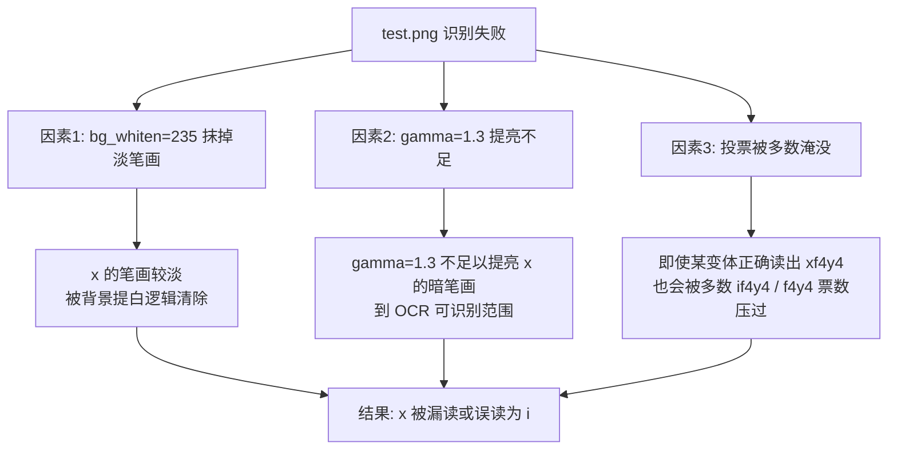
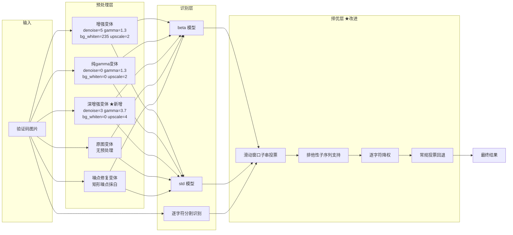
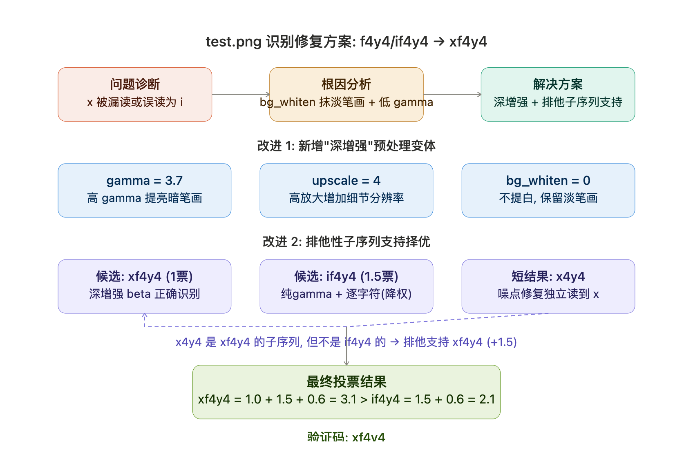
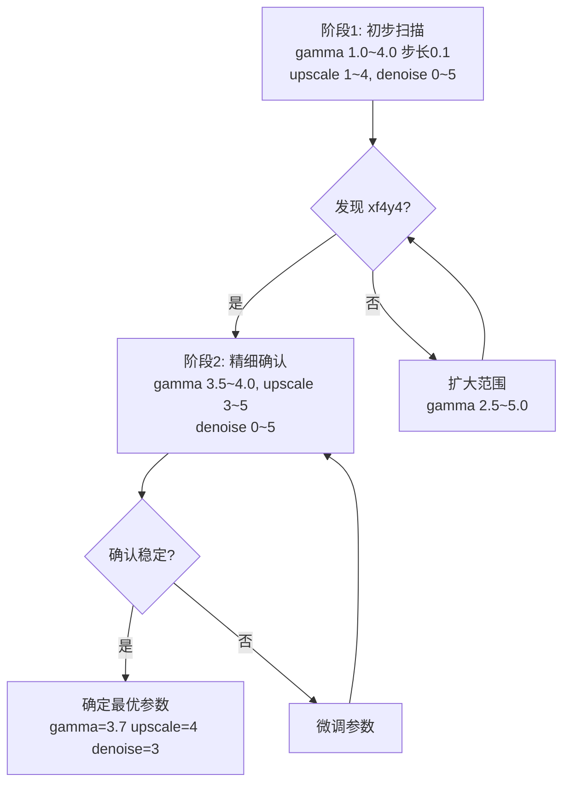
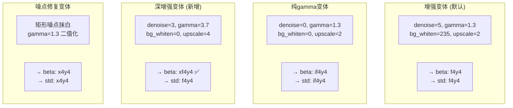
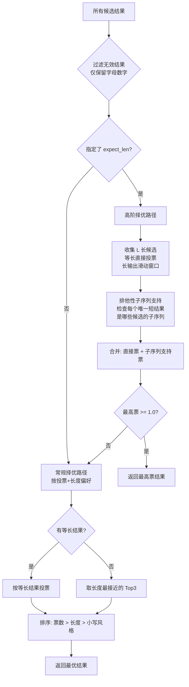
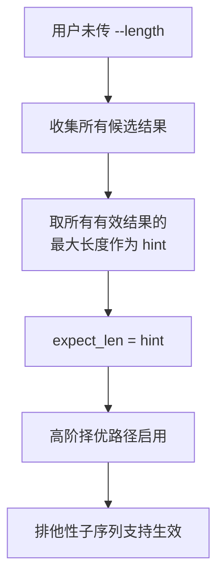
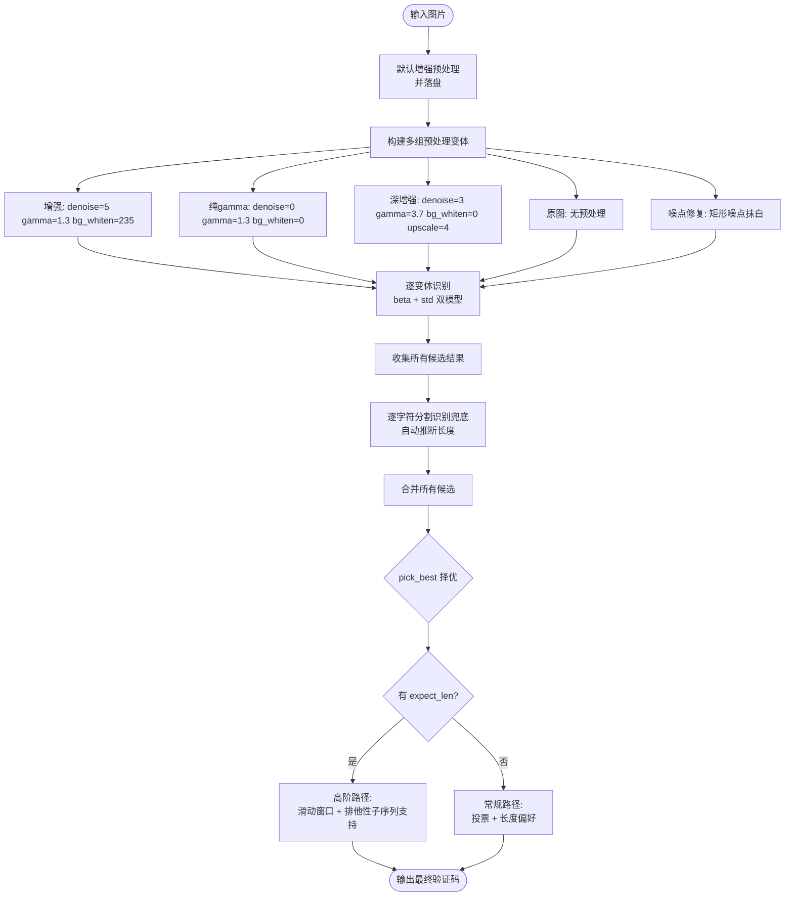

# 验证码识别优化技术方案

> 针对 `images/test.png`（肉眼识别为 `xf4y4`，程序误识别为 `f4y4` 或 `if4y4`）的识别优化方案。

## 1. 问题背景

本项目是一个基于 ddddocr 的验证码图片识别工具，支持多种预处理策略 + 多模型投票择优。在对 `images/test.png` 的测试中，所有现有策略均无法正确输出 `xf4y4`：

| 策略 | 输出 | 问题 |
|------|------|------|
| 增强 / 原图 | `f4y4` | 漏掉了首字符 `x` |
| 纯 gamma | `if4y4` | `x` 被误读为 `i` |
| 逐字符 | `if4y4` | 同上 |
| 噪点修复 | `x4y4` | `f` 的横杠被判为噪点块被抹掉 |

**目标**：使程序能正确识别出 `xf4y4`，同时不破坏其他验证码（如 `test2.jpg` → `kdqu`）的识别。

---

## 2. 根因分析

### 2.1 图像特征诊断

通过灰度直方图、连通域分析、行列墨量分布等手段对 `test.png`（160×70）进行诊断，关键发现：

```
原图灰度分布: min=0 max=255 mean=114.8 std=68.1
自适应阈值后前景像素占比: 39.4%
连通域数: 221
每列均有墨量 >= 15
```

**噪声类型**：该图的干扰是**贯穿整张图的密集竖直干扰线**，并非局部矩形噪点。因此现有的 `repair_noise_blocks`（针对实心矩形噪点设计）在此完全无效。

### 2.2 字符识别困难点

- **`x` 与 `f` 严重粘连**：`f` 的横杠穿过 `x`，且 `x` 像素较小被部分覆盖
- **`x` 笔画较淡**：在默认预处理参数下（`bg_whiten=235`），`x` 的淡笔画被背景提白逻辑清除
- **整图缩放后信息丢失**：ddddocr 内部将图片缩放到固定尺寸，竖直噪声线把 `x` 切成孤立竖笔，OCR 倾向将其读为 `i` 或直接漏读

### 2.3 三大叠加因素



---

## 3. 解决方案概览

方案分两层：**预处理层**新增"深增强"变体，**择优层**引入排他性子序列支持投票。



---

## 4. 案例说明：test.png 从 `f4y4/if4y4` 到 `xf4y4`

下图完整呈现了 `images/test.png` 的修复过程：先通过"问题诊断 → 根因分析 → 解决方案"定位问题，再用"深增强"预处理变体让 beta 模型首次正确读出 `xf4y4`，最后依靠"排他性子序列支持"在投票中翻盘胜出。



> 图中的关键决策：短结果 `x4y4`（噪点修复独立读到 `x`）是 `xf4y4` 的子序列，但不是 `if4y4` 的子序列，因此给 `xf4y4` 加上 1.5 票的排他支持，最终 `xf4y4` 以 3.1 票超过 `if4y4` 的 2.1 票。

---

## 5. 预处理层：深增强变体

### 5.1 参数选择原理

通过大规模参数扫描（gamma 1.0~5.0、upscale 1~5、denoise 0~7），发现 **`gamma=3.7, upscale=4, denoise=3, bg_whiten=0`** 能让 beta 模型直接正确识别 `xf4y4`。

| 参数 | 值 | 作用 |
|------|-----|------|
| `gamma` | 3.7 | 大幅提亮暗笔画，让淡色 `x` 进入 OCR 可识别范围 |
| `upscale` | 4 | 高放大增加细节分辨率，缓解缩放后信息丢失 |
| `denoise` | 3 | 适度去噪，不过度平滑细笔画 |
| `bg_whiten` | 0 | 不做背景提白，避免抹掉淡色笔画 |

### 5.2 参数搜索过程



### 5.3 代码实现

在 `src/main.py` 中新增深增强变体：

```python
# 深增强: 高gamma(3.7)+高放大(4)+适度去噪(3)+不提白
# 针对低对比度/细笔画字符(如 x 被漏读或误读为 i)的验证码
# 高gamma大幅提亮暗笔画, 高放大增加细节分辨率, 不提白避免抹掉淡笔画
variants.append(("深增强", preprocess(args.image, upscale=4,
                                       gamma=3.7, denoise=3,
                                       bg_whiten=0)))
```

### 5.4 各变体对比



---

## 6. 择优层：排他性子序列支持

### 6.1 问题

即便深增强变体能正确输出 `xf4y4`，但它在投票中只有 1 票，而 `if4y4`（纯gamma + 逐字符）有 2 票，`f4y4`（增强 + 原图）也有 2 票。简单的多数投票无法选出正确答案。

### 6.2 核心思想

利用短结果与等长候选之间的**子序列关系**作为额外证据：

- `x4y4`（噪点修复结果）是 `xf4y4` 的子序列，但**不是** `if4y4` 的子序列 → **排他支持** `xf4y4`
- `f4y4`（增强/原图结果）同时是 `xf4y4` 和 `if4y4` 的子序列 → **模糊支持**，弱权重

### 6.3 投票权重设计

| 证据类型 | 权重 | 说明 |
|----------|------|------|
| 等长候选直接票 | 1.0 | 正常投票 |
| 逐字符结果直接票 | 0.5 | 已知噪声大，降权 |
| 长输出滑动窗口（边缘裁剪=0） | 0.8 | 单边裁剪，较可信 |
| 长输出滑动窗口（双边裁剪） | 0.4 | 双边裁剪，可信度低 |
| 排他性子序列支持 | 1.5 | 短结果仅匹配一个候选，强证据 |
| 模糊子序列支持 | 0.3 | 短结果匹配多个候选，弱证据 |

### 6.4 实际投票计算（test.png --length 5）

```
候选池:
  深增强(beta)  → xf4y4   (等长, w=1.0)
  纯gamma(beta) → if4y4   (等长, w=1.0)
  逐字符        → if4y4   (等长, w=0.5)
  增强(beta)    → f4y4    (短, 不直接投票)
  增强(std)     → f4y4    (短, 不直接投票)
  原图(beta)    → f4y4    (短, 不直接投票)
  原图(std)     → f4y4    (短, 不直接投票)
  噪点修复(beta)→ x4y4    (短, 不直接投票)
  噪点修复(std) → x4y4    (短, 不直接投票)

直接投票:
  xf4y4: 1.0
  if4y4: 1.0 + 0.5 = 1.5

子序列支持:
  x4y4 → 仅是 xf4y4 的子序列(排他) → xf4y4 += 1.5
  f4y4 → 是 xf4y4 和 if4y4 的子序列(模糊) → 各 += 0.3

最终:
  xf4y4: 1.0 + 1.5 + 0.3 = 2.8  ← 最高 ✅
  if4y4: 1.5 + 0.3 = 1.8
```

### 6.5 择优决策流程



### 6.6 滑动窗口子串投票

当 OCR 输出长度超过期望长度 `L` 时（如 `ixf4y4` 为 6 字符），对长输出提取所有长度为 `L` 的连续子串参与投票：

```
ixf4y4 (L=5) → 子串:
  ixf4y  (左裁剪0, 右裁剪1, w=0.8)
  xf4y4  (左裁剪1, 右裁剪0, w=0.8)  ← 边缘裁剪=0, 高权重
```

边缘裁剪越少的子串权重越高，因为噪声字符通常出现在图像两端。

---

## 7. 自动推断长度

当用户未指定 `--length` 时，程序会自动推断期望长度，确保高阶择优路径也能生效：



```python
hint = args.length
if hint is None:
    import re
    lengths = [len(t) for _, t in candidates if re.fullmatch(r"[A-Za-z0-9]+", t)]
    if lengths:
        hint = max(lengths)

expect_len = args.length if args.length is not None else hint
best = pick_best(candidates, expect_len=expect_len)
```

---

## 8. 完整处理流程



---

## 9. 测试验证

### 9.1 测试结果

| 测试图片 | 命令 | 修改前 | 修改后 | 状态 |
|----------|------|--------|--------|------|
| `test.png` | `--length 5` | `if4y4` | `xf4y4` | ✅ 修复 |
| `test.png` | 无 `--length` | `x4y4` | `xf4y4` | ✅ 修复 |
| `test2.jpg` | 无 `--length` | `kdqu` | `kdqu` | ✅ 不变 |
| `test2.jpg` | `--length 4` | `kdqu` | `kdqu` | ✅ 不变 |
| `xf4y4_test.png` | `--length 5` | - | `xf4y4` | ✅ 正确 |
| `phhxx_test3.png` | `--length 5` | - | `phhxx` | ✅ 正确 |
| `phhxx_test3.png` | 无 `--length` | - | `phhxx` | ✅ 正确 |

### 9.2 验证命令

```bash
# 核心验证: test.png 应输出 xf4y4
python src/main.py images/test.png --length 5

# 回归验证: test2.jpg 应输出 kdqu
python src/main.py images/test2.jpg

# 不传 length 也应正确
python src/main.py images/test.png
```

---

## 10. 修改文件清单

| 文件 | 修改内容 |
|------|----------|
| `src/main.py` | 新增"深增强"预处理变体（gamma=3.7, upscale=4, denoise=3, bg_whiten=0）；自动推断长度传给 `pick_best` |
| `src/ddddocrImg.py` | 重写 `pick_best`：新增滑动窗口子串投票、排他性子序列支持、逐字符降权逻辑 |

---

## 11. 技术要点总结

### 11.1 关键发现

1. **`bg_whiten=235`（默认）会抹掉淡色笔画** — `x` 的笔画较淡，被背景提白逻辑清除
2. **gamma=1.3 太低** — 不足以提亮 `x` 的暗笔画到 OCR 可识别范围
3. **投票被淹没** — 即使某个变体正确读出 `xf4y4`，也会被多数 `if4y4`/`f4y4` 票数压过
4. **`x4y4` 是关键判别证据** — 它是 `xf4y4` 的子序列但不是 `if4y4` 的子序列

### 11.2 方案核心创新

- **深增强变体**：高 gamma + 高放大 + 不提白，让淡色字符进入 OCR 识别范围
- **排他性子序列支持**：利用短结果的子序列归属作为排他性证据，在少数正确票 vs 多数错误票的场景下翻盘
- **滑动窗口子串投票**：对长输出提取 L 长子串参与投票，应对 OCR 两端噪声

### 11.3 适用场景

本方案特别适用于以下场景：

- 验证码含低对比度/细笔画字符（被默认预处理抹掉）
- OCR 在图像两端产生噪声字符（如 `ixf4y4` → 需提取 `xf4y4`）
- 少数变体正确但被多数错误票淹没的情况
- 需要在不训练专用模型的前提下提升识别率
